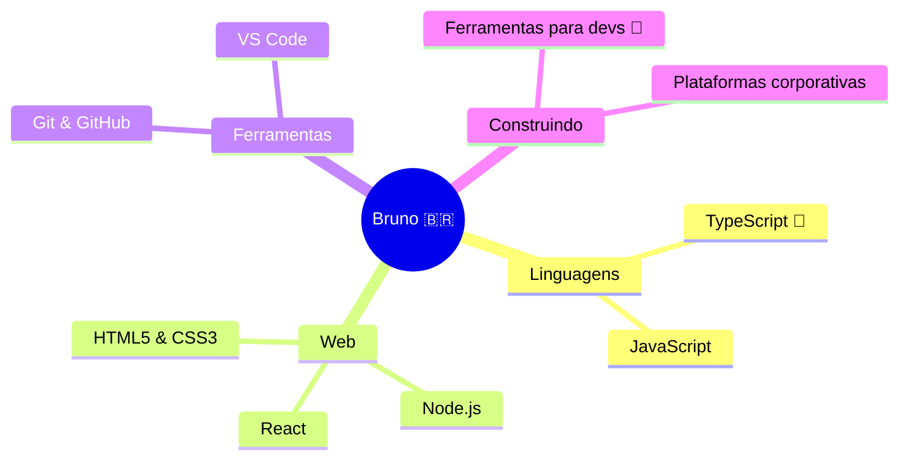
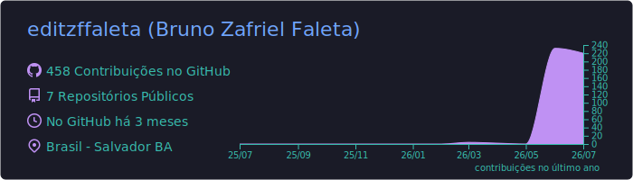
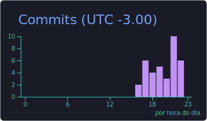
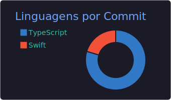

<!-- ============================================================
     PERFIL DE BRUNO ZAFRIEL FALETA (@editzffaleta)
     Paleta: verde #2ea043 · azul #1f6feb · fundo #0d1117
     ============================================================ -->

<!-- BANNER -->
<div align="center">
  
</div>

<!-- TEXTO DIGITANDO -->
<div align="center">
  <a href="https://github.com/editzffaleta">
    
  </a>
</div>

<br/>

<!-- SOBRE MIM -->
## 🧑‍💻 Sobre mim

```typescript
const bruno = {
  nome: "Bruno Zafriel Faleta",
  localizacao: "Brasil 🇧🇷",
  funcao: "Desenvolvedor Web",
  foco: ["Aplicações web", "Plataformas corporativas", "Ferramentas de IA"],
  linguagemDoCoracao: "TypeScript",
  aprendendoAgora: "Sempre alguma coisa nova 🚀",
  fatoDivertido: "Acredito que todo problema real merece uma ferramenta bem feita",
} as const;

type Desenvolvedor = typeof bruno; // em constante evolução 😉
```

- 🔭 Atualmente construindo novos projetos em **TypeScript** — em breve nesta página!
- 🌱 Evoluindo todos os dias em **TypeScript** e no ecossistema web
- 💬 Pode me chamar para falar de **JavaScript, Node.js e React**
- ⚡ Lema: *código bom é código que resolve problema de verdade*

> [!TIP]
> Estou sempre aberto a trocar ideia sobre projetos e colaborações — é só abrir uma issue ou discussão em qualquer repositório meu!

<br/>

<!-- ====================================================================
PROJETOS EM DESTAQUE (ATIVE QUANDO OS REPOSITÓRIOS EXISTIREM)
Para ativar: remova esta linha e a última do bloco de comentário,
e ajuste os nomes dos repositórios ("repo=...") se necessário.

## 🚀 Projetos em destaque

<div align="center">
  <a href="https://github.com/editzffaleta/brasil-utils">
    
  </a>
  <a href="https://github.com/editzffaleta/meu-bolso">
    
  </a>
  <br/>
  <a href="https://github.com/editzffaleta/devbr-cli">
    
  </a>
  <a href="https://github.com/editzffaleta/taskboard-live">
    
  </a>
</div>

<br/>
==================================================================== -->

<!-- TECNOLOGIAS -->
## 🛠️ Tecnologias & Ferramentas

<div align="center">
  <a href="https://skillicons.dev">
    
  </a>
  <br/>
  <a href="https://skillicons.dev">
    
  </a>
</div>

<details>
  <summary>🧠 <b>Ver minha stack como mapa mental</b> (renderizado nativamente pelo GitHub!)</summary>
  <br/>



</details>

<br/>

<!-- ESTATÍSTICAS -->
## 📊 Estatísticas do GitHub

<div align="center">
  
  
</div>

<div align="center">
  
</div>

<br/>

<div align="center">
  
</div>

<details>
  <summary>📈 <b>Mais estatísticas</b> (clique para expandir)</summary>
  <br/>
  <div align="center">
    <!-- Cards gerados e traduzidos pelo workflow .github/workflows/cards-ptbr.yml -->
    
    
    
  </div>
</details>

<br/>

<!-- COBRINHA DAS CONTRIBUIÇÕES -->
## 🐍 Cobrinha das contribuições

<div align="center">
  <picture>
    <source media="(prefers-color-scheme: dark)" srcset="https://raw.githubusercontent.com/editzffaleta/editzffaleta/output/github-snake-dark.svg"/>
    <source media="(prefers-color-scheme: light)" srcset="https://raw.githubusercontent.com/editzffaleta/editzffaleta/output/github-snake.svg"/>
    
  </picture>
</div>

<br/>

<!-- CITAÇÃO -->
## 💭 Citação dev do momento

<div align="center">
  
</div>

<br/>

<!-- ====================================================================
SEÇÃO DE CONTATO (DESATIVADA POR ENQUANTO)
Quando tiver seus links, REMOVA esta linha e a última linha deste bloco
de comentário (as setas) para ativar a seção.
Depois troque os "#" pelos links reais e o e-mail.

## 📫 Contato

<div align="center">
  <a href="#"></a>
  <a href="mailto:SEU-EMAIL@exemplo.com"></a>
  <a href="#"></a>
  <a href="#"></a>
</div>

<br/>
==================================================================== -->

<!-- RODAPÉ -->
<div align="center">
  
</div>

<div align="center">
  
</div>
